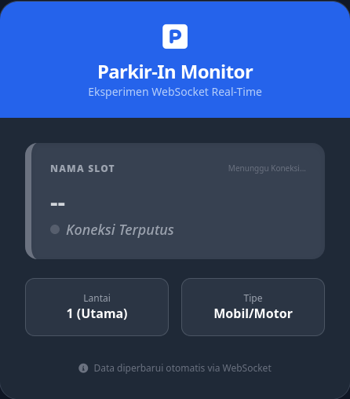
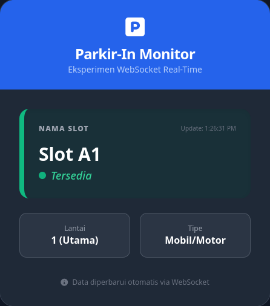
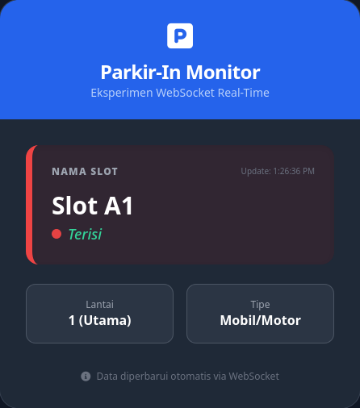

# Parkir-In: Real-Time Parking Monitoring System

**Parkir-In** adalah prototipe sistem pemantauan ketersediaan slot parkir secara *real-time* yang dibangun menggunakan protokol **WebSocket**.

---

## Fitur Utama
* **Real-Time Update:** Status slot parkir diperbarui secara instan tanpa *refresh*.
* **Visual Feedback:** Perubahan warna antarmuka (Hijau/Merah) berdasarkan status.
* **Low Latency:** Menggunakan WebSocket untuk meminimalkan *overhead* data.

---

## Teknologi yang Digunakan
* **Backend:** Node.js
* **Library:** `ws` (WebSocket library)
* **Frontend:** HTML5, JavaScript (ES6+), Tailwind CSS

---

## Dokumentasi Eksperimen

### 1. Koneksi Awal (Standby)


*Gambar 1: Antarmuka dalam kondisi menunggu koneksi server.*

### 2. Slot Tersedia (Available)


*Gambar 2: Notifikasi real-time saat slot parkir kosong.*

### 3. Slot Terisi (Occupied)


*Gambar 3: Perubahan status visual saat slot digunakan.*

---

## Cara Menjalankan Proyek

1. **Clone repositori ini:**
   ```bash
   git clone https://github.com/dnrprsty/Web-Socket_Parkir_IN.git
   ```

2. **Instal dependensi:**
   ```bash
   npm install
   ```

3. **Jalankan server:**
   ```bash
   node server.js
   ```

4. **Buka aplikasi:**
   Buka file `index.html` di browser lu.

---
